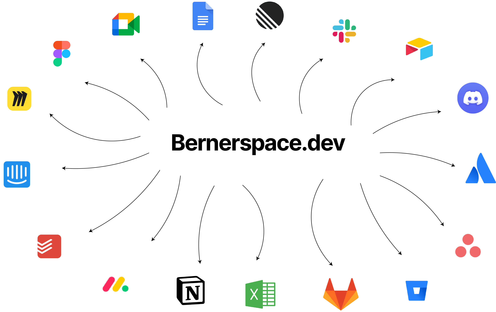

# Bernerspace  

### One MCP server · All your integrations · Zero hassle

[](https://github.com/bernerspace/bernerspace/stargazers)
[](https://github.com/bernerspace/bernerspace/issues)
[](LICENSE)
[](https://www.notion.so/sumitsandbox/Bernerspace-quick-start-24be21126afc80d3b765dd75556e6e50)
[](mailto:sumit@example.com)

<p align="center">
  
</p>

<p align="center">
  🚀 <b>Unified MCP server for all OAuth-enabled integrations</b><br>
  <i>One server · One JWT · Many tools</i>
</p>

<p align="center">
  ✅ <b>Current Live Integration:</b> Slack — <b>47 tools</b> tested & available <br>
  🔜 <b>Coming Soon:</b> Gmail · Google Calendar · Notion <br>
  🎯 <b>Goal:</b> 100+ integrations
</p>


## Why

Using or integrating MCP servers today is painful because:

- Most MCP servers lack OAuth capabilities, limiting user experience.
- Every MCP server requires separate deployment and management, increasing operational overhead.
- Integration chaos: different authentication layers across MCP servers make unified integration nearly impossible.

## What You Get

- Single JWT across services via middleware (HS256, issuer/audience validated).
- OAuth middleware per integration (Slack live; more coming) with DB‑backed token storage.
- Consistent MCP tools interface for each service.
- Unified endpoints you can self‑host, e.g.:
  - <http://localhost:8000/mcp/slack>
  - <http://localhost:8000/mcp/gmail> (coming soon)


## Current Status

- Current live integration: **Slack** with 47 fully tested tools available.  
  → Learn more about Slack tools: [docs/slack/tools.md](docs/slack/tools.md)  
- Coming soon: **Gmail**, **Google Calendar**, and **Notion**.

## 📖 Documentation

All setup instructions, integration guides, and examples are available on our Notion docs:  

🔗 **[Bernerspace Quick Start Docs](https://www.notion.so/sumitsandbox/Bernerspace-quick-start-24be21126afc80d3b765dd75556e6e50)**

The docs are updated regularly with:

- Quick start guides for new integrations
- Step-by-step installation instructions
- Usage examples for each tool
- Roadmap and contribution guidelines


## Quickstart

1. Environment

Create a `.env` with the following variables:

```bash
JWT_SECRET=your-jwt-signing-secret
DATABASE_URL=postgresql://localhost:5432/mcp_server
CLIENT_ID=<slack_client_id>
CLIENT_SECRET=<slack_client_secret>
SLACK_REDIRECT_URI=http://localhost:8000/mcp/slack/oauth/callback
```

1. Install dependencies (choose one)

- Using pip
  - python3 -m venv .venv && source .venv/bin/activate
  - pip install -e .
- Using uv
  - uv venv && source .venv/bin/activate
  - uv pip install -e .

1. Run the server

- Using Python
  - python server.py
  - Server will listen on <http://localhost:8000>
- Using Docker
  - docker build -t bernerspace-mcp .
  - docker run --env-file .env -p 8000:8000 bernerspace-mcp
  - Server will listen on <http://localhost:8000>
- Using Docker Compose
  - docker compose up -d

1. Create a JWT to call the MCP server

- python generate_jwt.py --user-id <your_user_id>
- Use the printed token as: Authorization: Bearer TOKEN

## OAuth Flow (Slack)

- GET /mcp/slack returns `oauth_url` and instructions to authorize the workspace.
- Slack redirects to `SLACK_REDIRECT_URI` (defaults to `/mcp/slack/oauth/callback`).
- The server exchanges the code, enriches the token details, and persists it in Postgres.
- Tokens are stored in table `oauth_tokens` with composite key `(client_id, integration_type)` where `client_id` = your JWT subject (`sub`).

## Database

- Schema managed with Alembic (migrations included).
- Table: `oauth_tokens(client_id, integration_type, token_json, stored_at)`.
- Configure Postgres via `DATABASE_URL`.


## MCP Client Configuration

Example client entry (mcp.json):

```json
{
  "servers": {
    "slack": {
      "url": "http://localhost:8000/mcp/slack",
      "type": "http",
      "headers": {
        "Authorization": "Bearer YOUR_JWT"
      }
    }
  }
}
```

If the user hasn’t completed OAuth, tool calls will return an object with `requires_auth: true` and an `oauth_url` you can open to complete authorization.

## VS Code MCP Client Setup

Use this `mcp.json` in your VS Code user settings (replace `JWT` with your generated token):

```json
{
  "servers": {
    "slack": {
      "url": "http://localhost:8000/mcp/slack",
      "type": "http",
      "headers": {
        "Authorization": "Bearer JWT"
      }
    }
  },
  "inputs": []
}
```

## LangChain Example

```python
from langchain_mcp_adapters.client import MultiServerMCPClient
from langgraph.prebuilt import create_react_agent

client = MultiServerMCPClient(
    {
        "slack": {
            "transport": "streamable_http",
            "url": "http://localhost:8000/mcp/slack",
            "headers": {
                "Authorization": "Bearer YOUR_TOKEN"
            },
        }
    }
)

tools = await client.get_tools()
agent = create_react_agent("openai:gpt-4.1", tools)
response = await agent.ainvoke({"messages": "Can you send hello message to my #general groups?"})
```

## Docker

You can run Bernerspace MCP in Docker:

```bash
docker build -t bernerspace-mcp .
docker run --env-file .env -p 8000:8000 bernerspace-mcp
```

## 🚀 Roadmap

We’re just getting started. Our goal is to support **100+ integrations** so you can connect any third-party service to your MCP server with ease.

### Coming Soon

- 📧 Gmail  
- 📅 Google Calendar  
- 📂 Google Drive  
- 🗂️ Notion  
- 💻 GitHub  
- 💬 Discord  
- 📊 Airtable  
- 🔍 ElasticSearch  
- 📝 Confluence  

…and dozens more on the way.


## 🤝 Contributing

We welcome contributions of all kinds — whether it’s fixing a bug, suggesting a feature, improving documentation, or just sharing feedback.

### Ways to Contribute

- ⭐ **Star the repo** to show your support and help others discover Bernerspace.  
- 🐛 [Report a bug](https://github.com/bernerspace/bernerspace/issues/new/choose) so we can fix it quickly.  
- 💡 [Request a feature](https://github.com/bernerspace/bernerspace/issues/new/choose) or suggest an improvement.  
- 🛠️ Submit a Pull Request with code changes, docs updates, or tests.  

### Stay in Touch

- 📧 Email me at [ranga.sumit1999@gmail.com](mailto:ranga.sumit1999@gmail.com)  
- 🐦 Follow & DM on Twitter (X): [@SumitSandbox](https://x.com/SumitSandbox)  

Whether you’re a first-time contributor or an experienced developer, we’d love to hear from you and collaborate!

## License

This project is licensed under the [MIT License](LICENSE).
