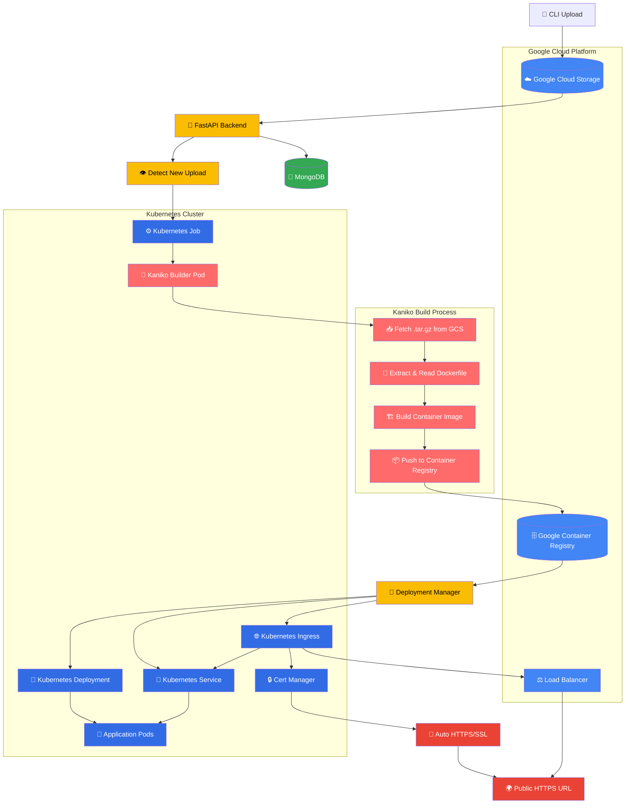

# Bernerspace

A streamlined deployment platform that enables developers to quickly deploy applications to the cloud with automatic HTTPS, container building, and infrastructure management.

## Overview

Bernerspace simplifies the deployment process by providing a CLI tool that packages your applications and deploys them to a Kubernetes cluster with automatic container building, service discovery, and HTTPS termination.

## Architecture

### Core Components

- **CLI Tool** (`ts/cli/`): TypeScript-based command-line interface for project management and deployment
- **Backend API** (`core/`): Python FastAPI server handling project management, file uploads, and deployment orchestration
- **Cloud Infrastructure**: Google Cloud Platform with Kubernetes, Cloud Storage, and Container Registry

### How Deployment Works


```mermaid
graph TB
    %% Upload Phase
    CLI[🔧 CLI Upload] --> GCS[(☁️ Google Cloud Storage)]
    
    %% Backend Detection
    GCS --> BACKEND[🐍 FastAPI Backend]
    BACKEND --> MONGO[(🍃 MongoDB)]
    BACKEND --> DETECT[👁️ Detect New Upload]
    
    %% Kubernetes Build Pipeline
    DETECT --> K8S_JOB[⚙️ Kubernetes Job]
    K8S_JOB --> KANIKO[🔨 Kaniko Builder Pod]
    
    %% Kaniko Build Process
    KANIKO --> FETCH[📥 Fetch .tar.gz from GCS]
    FETCH --> EXTRACT[📂 Extract & Read Dockerfile]
    EXTRACT --> BUILD[🏗️ Build Container Image]
    BUILD --> PUSH[📦 Push to Container Registry]
    
    %% Registry and Deployment
    PUSH --> REGISTRY[(🗄️ Google Container Registry)]
    REGISTRY --> DEPLOY_MGR[🎯 Deployment Manager]
    
    %% Kubernetes Resources Creation
    DEPLOY_MGR --> K8S_DEPLOY[🚀 Kubernetes Deployment]
    DEPLOY_MGR --> K8S_SVC[🔗 Kubernetes Service] 
    DEPLOY_MGR --> K8S_INGRESS[🌐 Kubernetes Ingress]
    
    %% Application Runtime
    K8S_DEPLOY --> PODS[📱 Application Pods]
    K8S_SVC --> PODS
    K8S_INGRESS --> K8S_SVC
    K8S_INGRESS --> CERT_MGR[🔒 Cert Manager]
    CERT_MGR --> HTTPS[🔐 Auto HTTPS/SSL]
    HTTPS --> PUBLIC_URL[🌍 Public HTTPS URL]
    
    %% Load Balancer
    K8S_INGRESS --> LB[⚖️ Load Balancer]
    LB --> PUBLIC_URL
    
    subgraph "Google Cloud Platform"
        direction TB
        GCS
        REGISTRY
        LB
    end
    
    subgraph "Kubernetes Cluster"
        direction TB
        K8S_JOB
        KANIKO
        K8S_DEPLOY
        K8S_SVC  
        K8S_INGRESS
        PODS
        CERT_MGR
    end
    
    subgraph "Kaniko Build Process"
        direction TB
        FETCH
        EXTRACT  
        BUILD
        PUSH
    end
    
    %% Styling
    classDef gcp fill:#4285f4,color:white
    classDef k8s fill:#326ce5,color:white
    classDef kaniko fill:#ff6b6b,color:white
    classDef storage fill:#34a853,color:white
    classDef app fill:#ea4335,color:white
    classDef mgmt fill:#fbbc04,color:black
    
    class GCS,REGISTRY,LB gcp
    class K8S_JOB,K8S_DEPLOY,K8S_SVC,K8S_INGRESS,PODS,CERT_MGR k8s
    class KANIKO,FETCH,EXTRACT,BUILD,PUSH kaniko
    class MONGO storage
    class PUBLIC_URL,HTTPS app
    class BACKEND,DETECT,DEPLOY_MGR mgmt
```

**Deployment Process:**

1. **Upload**: CLI packages application code into `.tar.gz` and uploads to Google Cloud Storage
2. **Detection**: FastAPI backend monitors for new uploads and triggers build process  
3. **Build**: Kaniko builder pod fetches source, builds container image, and pushes to registry
4. **Deploy**: Deployment manager creates Kubernetes resources (Deployment, Service, Ingress)
5. **Expose**: Ingress controller provisions load balancer and automatic HTTPS certificates
6. **Live**: Application runs with public HTTPS URL and automatic scaling

## Features

- **Automatic Container Building**: No need to build images locally - Kaniko handles this in the cluster
- **HTTPS by Default**: Automatic SSL certificate provisioning and management
- **GitHub OAuth Integration**: Secure authentication using GitHub accounts
- **Multi-language Support**: Auto-detection for Python, JavaScript/TypeScript, and other languages
- **Environment Variable Management**: Secure handling of application configuration
- **Project Versioning**: Track and manage multiple versions of your deployments

## Getting Started

### Prerequisites

- Node.js 20+ (for CLI)
- Python 3.12+ (for backend development)
- GitHub account (for authentication)
- Docker (if running locally)

### Installation

#### CLI Installation

```bash
# Clone the repository
git clone https://github.com/bernerspace/bernerspace.git
cd bernerspace/ts/cli

# Install dependencies
npm install

# Build and link globally
npm run build
npm link

# Verify installation
bernerspace --help
```

#### Backend Setup (Development)

```bash
# Navigate to backend
cd core/

# Create virtual environment
python -m venv venv
source venv/bin/activate  # On Windows: venv\Scripts\activate

# Install dependencies
pip install -r requirements.txt

# Set up environment variables
cp example.env .env
# Edit .env with your configuration

# Run the server
python main.py
```

### Usage

#### 1. Authentication

```bash
# Initialize and authenticate with GitHub
bernerspace init
```

This will:
- Open GitHub OAuth in your browser
- Create a new project or select an existing one
- Set up your local configuration

#### CLI Commands

The Bernerspace CLI provides three core commands:

```bash
# Initialize and deploy a project
bernerspace init

# View stored authentication details  
bernerspace details

# Clear authentication and log out
bernerspace logout
```

**`bernerspace init` workflow:**
1. **Authentication**: GitHub OAuth login (if not already authenticated)
2. **Project Setup**: Create new project or select existing one
3. **Auto-Detection**: Automatically detects language and checks for Dockerfile
4. **Environment Setup**: Configure environment variables for deployment
5. **Package & Upload**: Creates tarball and uploads to cloud infrastructure
6. **Deploy**: Triggers automatic build and deployment process

## Project Structure

```
bernerspace/
├── .github/workflows/    # CI/CD pipeline configuration
├── core/                 # Python FastAPI backend
│   ├── src/
│   │   ├── config/      # Configuration and authentication
│   │   ├── models/      # Database models (MongoDB with Beanie)
│   │   ├── routes/      # API endpoints
│   │   └── utils/       # Utility functions
│   ├── main.py          # Application entry point
│   └── requirements.txt # Python dependencies
├── ts/cli/              # TypeScript CLI tool
│   ├── src/
│   │   ├── commands/    # CLI command implementations
│   │   ├── config/      # API configuration
│   │   ├── types/       # TypeScript type definitions
│   │   └── utils/       # Utility functions
│   └── package.json     # Node.js dependencies
└── Dockerfile           # Container configuration for backend
```

## Environment Variables

### Backend Configuration

Create a `.env` file in the `core/` directory:

```env
MONGO_URI=your_mongodb_connection_string
DB_NAME=bernerspace
GCP_BUCKET=your_storage_bucket_name
GOOGLE_APPLICATION_CREDENTIALS=path_to_service_account.json
CLIENT_ID=your_github_oauth_client_id
CLIENT_SECRET=your_github_oauth_client_secret
```

### CLI Configuration

The CLI stores configuration in:
- **macOS**: `~/.bernerspace/config.json`
- **Linux**: `~/.config/bernerspace/config.json`
- **Windows**: `%APPDATA%\bernerspace\config.json`

## API Endpoints

### Projects
- `POST /projects/` - Create a new project
- `GET /projects/` - List user's projects
- `GET /projects/{id}` - Get project details

### Uploads
- `POST /projects/{id}/upload` - Upload project files
- `GET /projects/{id}/download/{version}` - Download project version

### Authentication
- `GET /callback` - GitHub OAuth callback handler

## Development

### Running Tests

```bash
# Backend tests (if implemented)
cd core/
python -m pytest

# CLI tests
cd ts/cli/
npm test
```

### Building for Production

```bash
# Build CLI
cd ts/cli/
npm run build

# Backend is containerized
docker build -t bernerspace-backend .
```

## Deployment

The project includes GitHub Actions workflows for automatic deployment:

- **Python CI**: Linting and dependency checks
- **TypeScript CI**: Building and testing
- **Cloud Deployment**: Automatic deployment to Google Cloud Run

## Contributing

1. Fork the repository
2. Create a feature branch (`git checkout -b feature/amazing-feature`)
3. Commit your changes (`git commit -m 'Add amazing feature'`)
4. Push to the branch (`git push origin feature/amazing-feature`)
5. Open a Pull Request

## License

This project is licensed under the MIT License - see the [LICENSE](LICENSE) file for details.

## Support

For issues and questions:
- Open an issue on GitHub
- Check the documentation in the repository
- Contact the maintainers

---

**Built with ❤️ by the Bernerspace team**